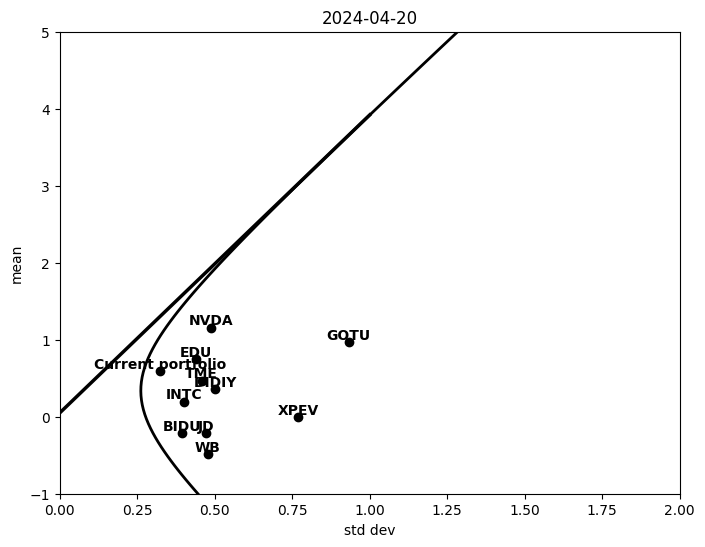

# This is my personal portfolio monitor


```python
import numpy as np
#numpy.random._bit_generator = numpy.random.bit_generator
import agent
import matplotlib.pyplot as plt
import seaborn as sn
from ohlc import ohlc
from portfolio import portfolio
from HierarchicalRiskParity import  HierarchicalRiskParity
import frontier
```


```python
ohlc_obj = ohlc()
ohlc_obj.load()
portf_obj = portfolio(ohlc=ohlc_obj.ohlc)
td_equity_dict = agent.getTdaPosition(type='EQUITY')
fidelity_equity_dict = agent.getFidelityPosition(type='EQUITY')
td_option_dict = agent.getTdaPosition(type='OPTION')
fidelity_option_dict = agent.getFidelityPosition(type='OPTION')

#Merge
equity_dict = {**td_equity_dict, **fidelity_equity_dict} 
option_dict = {**td_option_dict, **fidelity_option_dict} 
```

    [*********************100%%**********************]  1 of 1 completed
    [*********************100%%**********************]  1 of 1 completed


```python
for symbol,pos in  equity_dict.items():
    portf_obj.update_pos(symbol, pos)
    
print (portf_obj.sigma(method='hist') )    
print (portf_obj.sigma(method='garch') )

corr = portf_obj.corr()
heatmap = sn.heatmap(np.round(corr, 2), vmin=-1, vmax=1, annot=True, cmap='viridis')
plt.show()
```

    symbol
    TME      0.457825
    EDU      0.440170
    INTC     0.399347
    XPEV     0.769970
    JD       0.470851
    WB       0.477350
    DIDIY    0.502076
    NVDA     0.488238
    GOTU     0.932062
    BIDU     0.393873
    dtype: float64
    symbol
    TME      0.557414
    EDU      0.462652
    INTC     0.346421
    XPEV     0.892147
    JD       0.487259
    WB       0.543170
    DIDIY    1.035984
    NVDA     0.497497
    GOTU     1.270103
    BIDU     0.410990
    dtype: float64


    

    


```python
hrp =  HierarchicalRiskParity(portf_obj.corr(), date=ohlc_obj.current_date)


# Perform clustering
hrp.perform_clustering()
heatmap = sn.heatmap(np.round(hrp.linkage_matrix, 2), vmin=-2, vmax=2, annot=True, cmap='viridis')
plt.show()
# Allocate weights
hrp.allocate_weights()
print (hrp.weights)
# Plot the dendrogram
hrp.plot_dendrogram()

    
#plot_points(portf.mu().values, portf.sigma().values, portf.mu().index.to_list())
frontier.plot_points(np.append(portf_obj.mu().values, portf_obj.mu_p()), np.append(portf_obj.sigma().values, portf_obj.sigma_p()),
            portf_obj.mu().index.to_list() + ['Current portfolio'], ohlc_obj.current_date)
frontier.plot_min_var_frontier(portf_obj.mu().values, portf_obj.cov().values)
rf = 0.05
frontier.plot_Capital_Allocation_Line(rf, portf_obj.mu().values, portf_obj.cov().values)
#plt.show()

portf_obj.opt_min_risk()
portf_obj.opt_max_mean_with_sigma()
sigma = portf_obj.sigma_p()
print (portf_obj)
```


    

    


    [0.10099511 0.07923718 0.06438044 0.08525885 0.16821909 0.12191082
     0.07793345 0.062957   0.08665012 0.15245794]


    

    


    min_risk risk=0.08 Expected return=0.59
    symbol
    TME      0.11
    EDU      0.22
    INTC     0.28
    XPEV     0.00
    JD       0.00
    WB      -0.00
    DIDIY    0.10
    NVDA     0.25
    GOTU    -0.00
    BIDU     0.04
    dtype: float64
    <portfolio.portfolio object at 0x7fdae36c9100>


    /home/hui/.local/lib/python3.8/site-packages/cvxpy/reductions/solvers/solving_chain.py:336: FutureWarning: 
        Your problem is being solved with the ECOS solver by default. Starting in 
        CVXPY 1.5.0, Clarabel will be used as the default solver instead. To continue 
        using ECOS, specify the ECOS solver explicitly using the ``solver=cp.ECOS`` 
        argument to the ``problem.solve`` method.
        
      warnings.warn(ECOS_DEPRECATION_MSG, FutureWarning)


    

    


```python

```

